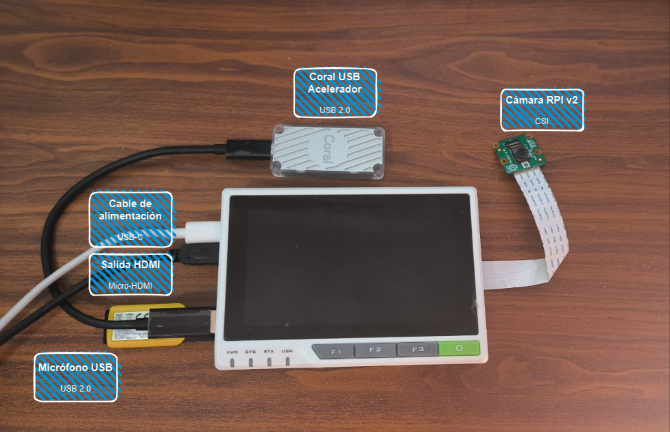
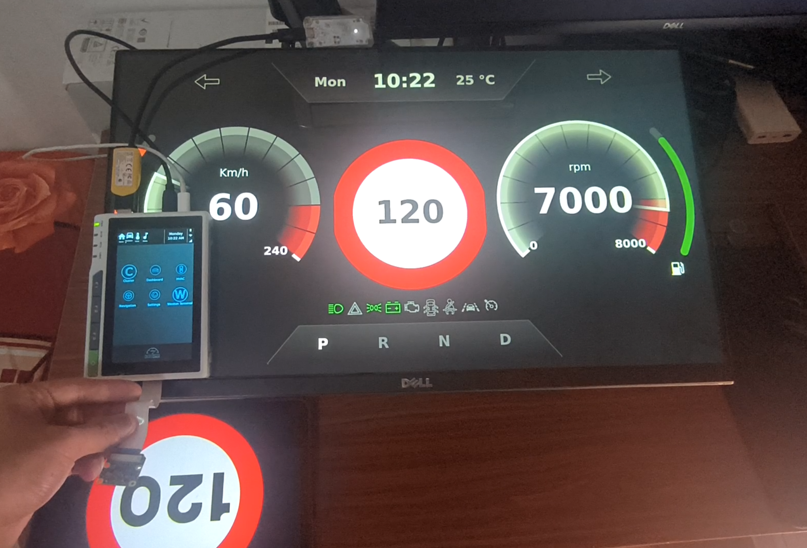

# META-AGL-RETERMINAL


## Proyect description

This layer is based on Automotive Grade Linux which provides a demo image of IVI (In-Vehicle-Infotainment) and intstrument cluster, as well as some funtionalities of machine learning.

## Layers dependencies 

- meta-agl: https://git.automotivelinux.org/AGL/meta-agl (branch kirkstone)
- meta-tensorflow-lite: https://github.com/7216nat/meta-tensorflow-lite
- meta-seeed-reterminal: https://github.com/Seeed-Studio/meta-seeed-cm4
- TFLite models and scripts: https://github.com/7216nat/tensorflow_ADAS_detection

## Compiling image

Download the `repo` tool and set permissions:


```
$ mkdir -p $HOME/bin
$ export PATH=$HOME/bin:$PATH
$ echo 'export PATH=$HOME/bin:$PATH' >> $HOME/.bashrc
$ curl https://storage.googleapis.com/git-repo-downloads/repo > $HOME/bin/repo
$ chmod a+x $HOME/bin/repo
```

Execute `build.sh` and you will get your workspcer ready on `$HOME/needlefish`:

```
$ sh build.sh

# Modify these 2 entries from $HOME/needlefish/seeed-reterminal/conf/local.conf
DL_DIR = "/path/to/download/directory/" >> $HOME/needlefish/seeed-reterminal/conf/local.conf
SSTATE_DIR = "/path/to/cache/directory/" >> $HOME/needlefish/seeed-reterminal/conf/local.conf
```

Build image:


```
$ cd $HOME/needlefish/seeed-reterminal
$ bitbake agl-ivi-cluster-demo-platform-flutter
```

After several hours of compiling. You can get the image in "build/tmp/deploy/images/seeed-reterminal" with .wic.bz2 suffix.

## Image download

Alternatively, you can download the image generated by github action in here: https://github.com/7216nat/meta-agl-reterminal/actions


## Test the image 

Follow this tutorial to install the image on reTerminal: https://wiki.seeedstudio.com/reTerminal/#flash-raspberry-pi-os-64-bit-ubuntu-os-or-other-os-to-emmc

Once the image is installed, you need to connect peripheral devices as show below:



Boot image and you will get:

